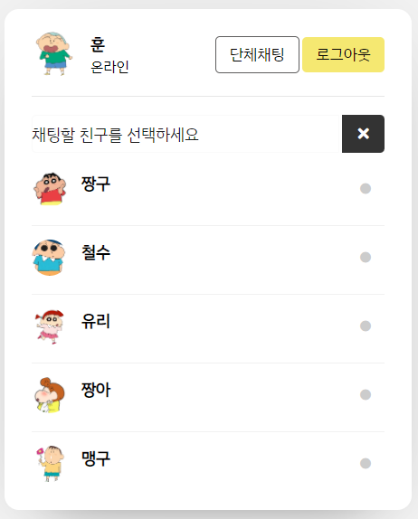

# webchat-clone
학교 과제에서 채팅프로그램을 만들라고 함
필자는 프론트,백 아무것도 모르기 때문에 기본적인 개념 공부 후 빠른 이해를 위해 클론 코딩을 해가며 구조를 파악해보기로 했다.

- 참고 YouTube   
https://www.youtube.com/watch?v=VnvzxGWiK54&t=6601s

## 개발환경
- vscode
- XAMPP
- html/css
- php

### 변경사항
- UI변경
- 그룹채팅방 만듦

### 회원가입 & 로그인
  

### 사람 목록

### 채팅

### 그룹채팅

- 웹의 기본적인 개념?구조를 알게 됨
- 자바 스크립트 공부하고, node.js를 이용해 다시 만들어 볼 것
